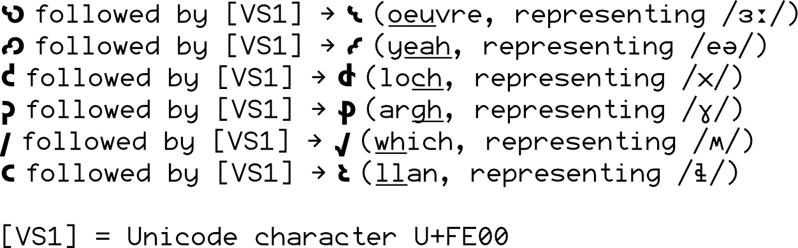

# Inter Alia

Inter Alia is an expanded version of Rasmus Andersson's beautiful open source sans serif typeface, [Inter](https://rsms.me/inter). Inter was specially designed for user interfaces with focus on high legibility of small-to-medium sized text on computer screens.

Inter Alia builds on the features of Inter to add:
- support for [the Shavian alphabet](https://www.shavian.info) with a newly designed set of glyphs, including the letters missing from Unicode (through character variants accessed by inserting 'Variation Selector 1' (U+FE00) after 𐑒, 𐑜, 𐑢, 𐑤, 𐑻, and 𐑺)
- support for old-style figures or numerals, also known as text figures, with both proportional and tabular spacing
- refinements to International Phonetic Alphabet glyphs and other less common glyphs.

Support for additional scripts may be considered in future.

## What to download (basic font files for everyday use)

Most users will want to download the OpenType files saved in [instance̠_otf](/instance_otf). To get the basic, standard set of font files, download:
- [Inter Alia Regular](instance_otf/InterAlia-Regular.otf)
- [Inter Alia Bold](instance_otf/InterAlia-Bold.otf)
- [Inter Alia Italic](instance_otf/InterAlia-Italic.otf)
- [Inter Alia Bold Italic](instance_otf/InterAlia-BlackItalic.otf)

If you have an older system and/or these files aren't working for some reason, you could try the equivalent TrueType files in [instance_ttf](/instance_ttf)

You will then need to install these fonts on your system, often by double clicking the files which should bring up a font manager program.

## Design

Inter Alia expands the Inter typeface with additional glyphs and features. Inter is similar to Roboto, San Francisco, Akkurat, Asap, Lucida Grande and other "UI" and "Text" typefaces. Some trade-offs were made in order to make this typeface work really well at small sizes. For details of the underlying approach to designing Inter, please see [https://github.com/rsms/inter](https://github.com/rsms/inter).

Current font styles:

| Name               | Weight class |
|--------------------|--------------|
| Thin               | 100          |
| Thin Italic        | 100          |
| Extra Light        | 200          |
| Extra Light Italic | 200          |
| Light              | 300          |
| Light Italic       | 300          |
| Regular            | 400          |
| Italic             | 400          |
| Medium             | 500          |
| Medium Italic      | 500          |
| Semi Bold          | 600          |
| Semi Bold Italic   | 600          |
| Bold               | 700          |
| Bold Italic        | 700          |
| Extra Bold         | 800          |
| Extra Bold Italic  | 800          |
| Black              | 900          |
| Black Italic       | 900          |

Inter Alia is also available as a variable font.

## Extended Shavian letters

The extended Shavian letters are either attested in Kingsley Read's work (the letters here called 'oeuvre', 'yeah', and 'loch' appear in the Shaw-Script journal), are derived from Quikscript ('loch', 'llan' and 'which') or are logically derived ('argh', for want of a better word in English).

They are not in Unicode so are a little tricky to produce. This requires using the 'Variation Selector 1' character in Unicode, U+FE00, as follows:

## Licence

Inter Alia is licensed under the [SIL Open Font License](LICENSE.txt)
